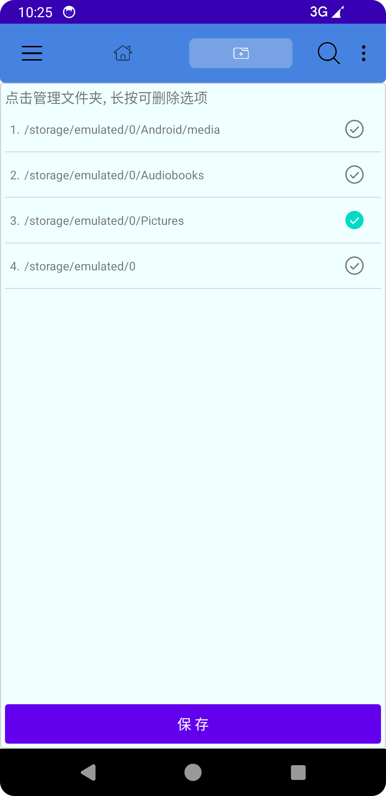
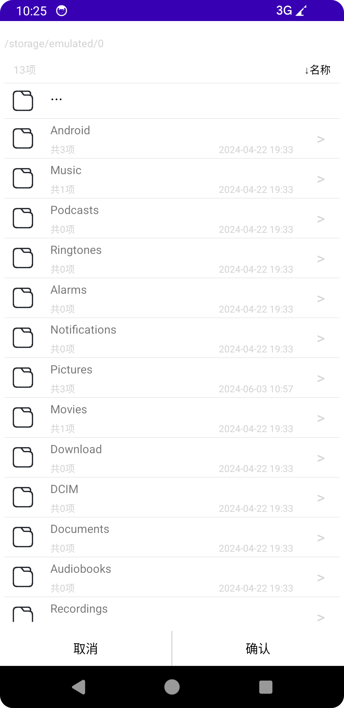

# ComicReader
轻量级漫画阅读工具（持续开发中），原生Android框架，未使用任何第三方依赖（因为不会用），虽然看着质朴，但是（好在）能用。

# 进度
基础功能已实现（13/22）
## 首页
- [x] 1.首页界面交互展示
- [x] 2.列表置换
- [x] 3.列表排序
- [x] 4.列表遮挡效果（新增无用功能）
- [x] 5.文件管理页面文件自定义
- [x] 6.文件管理页面文件路径选取功能（2024.05.30）
- [ ] 7.搜索功能
- [x] 8.Options手动刷新（2024.06.04）
- [x] 9.Options添加文件（2024.05.31）
- [ ] 10.Options添加收藏
- [ ] 11.Options历史记录
- [ ] 12.侧边栏全局设置
- [ ] 13.支持下拉列表自动刷新
- [ ] 14.实现ZIP文件内嵌套文件夹递归读出文件夹内容
- [x] 15.增加了主页展示列表为ROW模式下根据columns自适应缩放展示，后续功能会放在设置里支持自定义（2024.06.01）
- [x] 16.增加了支持修改单一条目功能。（2024.06.05） 

## 阅读页面进度
- [x] 1.界面显示 （2024.05.23）
- [x] 2.翻页跟随进度条|进度条跟随翻页 （2024.05.25）
- [ ] 3.翻页模式选择，支持横屏和竖屏滚屏翻页（当前仅支持竖屏翻页）
- [x] 4.支持自定义亮度调节 （2024.05.26）
- [ ] 5.支持图片缩放
- [ ] 6.支持阅读到末页时可选择跳转到列表下一条目

# 问题
> 内存占用问题，资源读取文件方法是通过Stream方式整体读取，遇到较大文件时耗费时间过长，且读取的压缩文件是乱序的，
> 目前方法是获取到全部数据流后放到列表中再排序，首页展示内容时只取列表第一条做封面，文件较多时同样耗时过长，且造成资源浪费，
> 应该有优化的空间。

# 项目截图
## 主页界面

## 文件管理
1. 

2. 

## 阅读界面

# 结言
> &emsp;&emsp;一直想要独立开发一款Android应用，刚学完Java就信心满满的开始新建文件夹，却由于技术力不足开发中途四处受阻，
> 每遇到问题查阅资料要耗费大量精力，网上分享的知识内容要么老旧要么货不对板筛选有用信息费时又费力，有时遇到想不通的问题就摆烂，
> 等到突然有灵感了再继续写，开发进度相当缓慢，好在最终还是写出个雏形来了，有些功能未能达到自己满意的结果，算是一大遗憾。 
> &emsp;&emsp;凭着三分钟热度写就的东西，终究将半途步止，一鼓作气，再而衰，三而竭，仅以纪念自己的初衷和最后的热情足矣。
